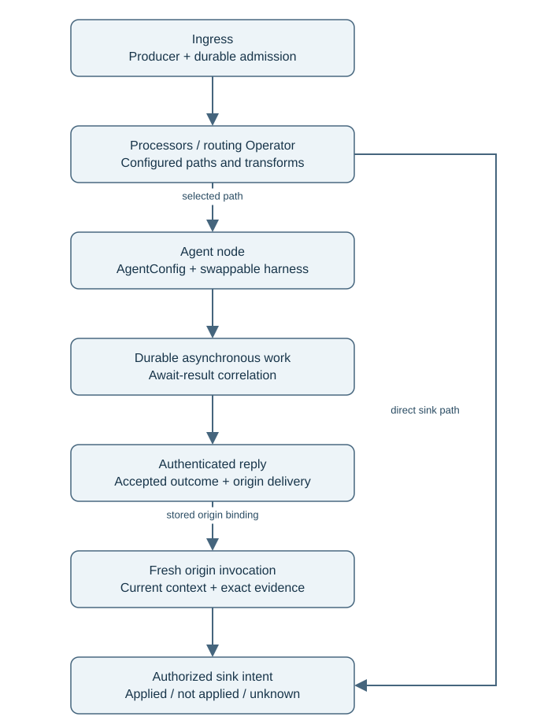
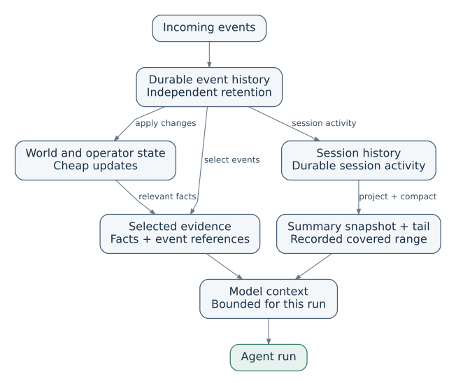
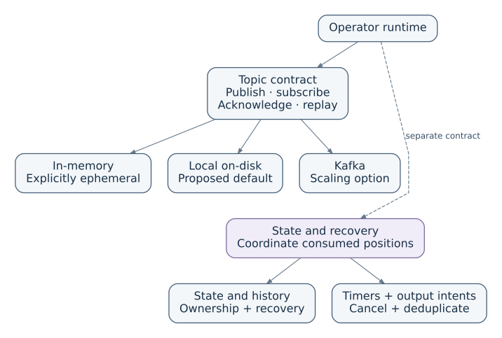

# Brook architecture

Brook is a Rust event-processing platform that runs agents when they add value.
Cheap rules, state updates and classifiers handle routine events; agents use
swappable harnesses for work that needs reasoning. The design below defines the
intended contracts. [Status and limits](#status-and-limits) distinguish them from
the current implementation.

## One event flow

```text
ingress → graph/processors → agent → asynchronous work → reply → sink
```

An event need not visit every stage. A processor can suppress it, transform it,
route it directly to a sink, or activate one or more agents. An agent is a graph
node, and awaited work is durable work whose result is delivered back to its
origin. The common work unit is a graph-node delivery. Agent execution and awaited
result delivery extend that model while retaining their own domain records.



[Editable flow](diagrams/operator-graph.mmd). The returning result starts a fresh
origin invocation; it is not an unbounded back-edge in the processing DAG.

1. **Ingress.** A producer authenticates its source and normalizes an event.
   Brook atomically checks its scoped operation identity, reserves capacity and
   records admission. The receipt confirms durable local acceptance, not eventual
   downstream delivery. A client combines a producer and a sink: the terminal is
   the first client, not the core source/sink abstraction.
2. **Graph/processors.** A Processor is the general node: it may update state,
   transform, filter, classify or emit outputs. An Operator specializes a
   Processor by choosing declared logical branches. Configuration connects those
   branches to paths. Inserting a transform anywhere on a configured path does
   not require the router to know about it or change its code.
3. **Agent.** A configured agent node receives bounded context and invokes its
   chosen harness. `AgentConfig` describes behavior, tools, model settings and
   budgets; the harness implements execution. Neither identifies the session.
   Any compatible harness can participate; a native Brook harness is optional.
4. **Asynchronous work.** The agent submits an authorized work intent through
   the same admission and delivery machinery. Fire-and-forget needs no result
   continuation. Await-result records correlation, expected responder, origin,
   causal references and expiry before dispatch. The immediate tool result is a
   pending receipt, so the agent need not remain suspended while waiting.
5. **Reply.** Brook authenticates and correlates the outcome, then atomically
   records it and its origin delivery. A fresh invocation receives current
   context plus exact request-specific evidence. Newer session activity remains
   intact even when replies arrive out of order.
6. **Sink.** Every external intent pins its authorized sink, account, recipient
   and data scope. Logical routing does not grant permission. The sink records
   success, confirmed non-application or an unknown outcome; uncertainty never
   triggers a blind resend.

## One durable execution and delivery model

A local transactional authority owns admission/deduplication, delivery state,
leases and generation fencing, node/session state, outbox intents, recovery and
resource accounting. A transaction covers one durable step, not an entire graph
or an LLM/network call. A successful processor commit records proposed state,
all downstream deliveries and input completion atomically. Awaited requests add
correlation and origin-result delivery to this model rather than creating another
scheduler with different durability rules.

Work pins graph, code, config, schema and destination-binding versions. A new
configuration cannot reinterpret an existing delivery or redirect an old intent.
State compatibility must be validated before activation; incompatible state
requires a reviewed migration or a new scope. Retries preserve logical identity
while advancing bounded physical attempts. A repeated evaluation can produce
only one accepted logical result; this does not promise one physical execution.

Worker heartbeats renew authoritative leases. Reassignment increments a
persistent ownership generation; state/result/effect-admission commits reject
stale or expired tokens. Ownership generation, cancellation generation and
context revision are distinct. Invocation cancellation fences its later commits.
Pipeline draining stops new ingress admission while admitted work settles.
Neither can retract an already admitted external effect.

The [local reliability contract](local-reliability.md) defines restart, failure,
capacity and retention rules. Unknown effects remain quarantined until suitable
adapter evidence or an explicitly authorized safe recovery action resolves them.

## Sessions and bounded context

Resolve `(authenticated namespace, trusted client, external conversation)` into
an opaque internal session. Payload fields cannot select another session or
principal. Agent-to-agent work has a source session, an authorized destination
work scope and a durable return binding; the destination never becomes the
origin merely because it processes the request.

The proposed initial scheduling policy allows one active agent invocation per
session. Waiting requests release that slot, so later activity and other replies
can advance the session. Resume
admission checks current revision and cancellation; a race causes reconstruction
or an explicit failure, never restoration of an old transcript. The
[context and routing contract](context-and-routing.md) defines the portable
pending-receipt/result flow.



[Editable context view](diagrams/state-and-context.mmd).

Context assembly selects exact protected causal evidence, a recent tail and
relevant current facts within an explicit budget. Pluggable compactors can
produce text, structured summaries or other historical representations with
source coverage and format versions. Pluggable retrievers select evidence from
authorized scopes; session-history references must belong to the same session.
External-corpus retrieval carries its own source identity and access checks.

A run does not require the entire historical transcript. Lossy representations
cannot replace required instructions, logical call/receipt/outcome associations
or other protected raw evidence. Missing or oversized required evidence fails
explicitly. Compaction changes context representation, not authority, history
identity or cancellation. It is not garbage collection: configurable seven-day
unused retention has separate eligibility rules and protects live references.

## Easy setup and extension boundaries

Useful defaults should cover the common 80% of workflows without complex YAML;
that is a product goal, not a measured result. Start with a terminal recipe,
then offer advanced graph composition when needed. Recipes, a Rust builder,
configuration imports and a future editor must use the same graph compiler.

Typed extension configuration and descriptors bind code, input/output/state
schemas, initial state and routing capabilities. A registry supplies configured
implementations. Simple map/filter/stateful/route helpers should avoid forcing
extension authors to handle leases or envelopes. The host validates proposals
and commits them; retriable evaluation must not perform irreversible network
writes. Native extensions retain host-process authority. Wasm is a preferred
future portable boundary with explicit capabilities and budgets, not an existing
sandbox or a selected runtime.

The typed control plane separates discovery, draft, validation, preview,
activation and status. An assisting agent can discover authorized connector
capabilities and prepare a concrete configuration preview. Discovery does not
actuate devices, grant permissions or activate subscriptions. Activation checks
draft revision, state compatibility and current authority; credentials remain
opaque references rather than event/config-preview content.

A future web DAG view should show configured paths alongside actual deliveries,
queue counts, selected branches, errors and uncertain outcomes. Observation is
read-only by default. Editing, activation, cancellation and replay are separately
authorized actions. Bounded telemetry must expose dropped updates and recover
with a consistent snapshot; slow viewers must not block durable completion.

## Sources, transport and follow-ups

Sources and sinks are generic adapters for clients and systems. Topic backends
may be in-memory, local on-disk or Kafka, with explicit durability, ordering,
subscription, replay and backpressure capabilities. Ephemeral acceptance cannot
claim durable restart guarantees. A transport backend does not replace the
shared execution authority or solve external exactly-once delivery.

The generic ingress envelope carries source-scoped event identity, payload type/
schema, causation/correlation and a validated partition/routing key. Session
identity is optional: device and system events need not be conversations.
Partition keys select ordering/state scopes; they do not grant sink authority.
Destination bindings remain a separate, authorized part of each outgoing intent.



[Editable transport boundary](diagrams/transport-boundary.mmd).

For example, a device temperature change can update current state without
starting an agent. An unavailable device can schedule bounded durable follow-up
work. When due, a new admitted event checks fresh state and either stops, alerts
a sink, or activates an agent with selected evidence. Gaps in source continuity
remain visible; stale data is not proof of a continuing outage.

[Recheck example](diagrams/home-assistant-recheck.svg) ·
[Editable example](diagrams/home-assistant-recheck.mmd).

The initial graph scope is a static DAG. An awaited result returns through a
stored origin binding as a separate invocation, not through an arbitrary graph
cycle. Broader dynamic waits, agent chains and message-only feedback need an
explicit admission contract. Outstanding-wait cycle detection is one modeled
candidate: concurrent checks and insertion must be atomic, and retries retain
logical identity. It does not itself prevent fire-and-forget loops. Causation,
hop/time/work budgets and terminal cleanup remain required design work before
expanding that scope.

## Status and limits

This architecture branch contains design documents and bounded TLA+ artifacts.
The downstream experimental Rust work supplies a local transactional core,
processor DAGs, typed Rust adapters, terminal effects and deterministic/crash
simulations. Its awaited-request and processor paths share Store/SQLite and the
local authority but duplicate work lifecycle machinery and lack a production bridge.
That gap is not the intended architecture; unification must preserve distinct
correlation/session records and applied/not-applied/unknown effect outcomes.

There is no selected production agent loop, stable extension API, generic
connector lifecycle, web control plane, Kafka/Wasm integration or distributed
execution contract. Terminal-specific APIs are the initial implementation slice,
not the desired generic core. The current context builder requires all retained
session history to fit its byte budget; it can fail even when a smaller evidence selection would suffice.
Explicit failure handling does not restore context fit. Trusted reconstruction
and comparison protect against forged context; a future opaque context token
could preserve that trust without repeating assembly. Bounded selection, the
separate compaction/retrieval experiment and seven-day collection still need
integration. Retained-record quotas do not by themselves prove physical
RAM/disk bounds under arbitrary native code or storage failure.

The [formal models and retained results](../spec/README.md) explore bounded safety
cases and unsafe alternatives. They assume atomic transitions and trusted
identity/authority inputs; they do not prove the implementation, composition,
liveness or eventual delivery. The dynamic-wait model explores a candidate
extension beyond the initial static DAG. Source/compiler tests, crash injection,
resource accounting and adapter-specific evidence remain necessary.

## Questions for review

1. What is the smallest bridge that makes agent work and result delivery use the
   shared execution model without weakening atomicity, isolation or fencing?
2. Which typed facade and graph compiler contracts make simple extensions easy
   while preserving versioned configuration and state compatibility?
3. How should protected evidence, recent context and extensible retrieval share
   bounded budgets, and what evidence allows each uncertain sink to recover?
4. Which dynamic waits/feedback are useful enough to justify expanding the static
   DAG contract, and what admission rules prevent unbounded work?
5. What migration, draining and connector activation semantics should the typed
   control plane expose before adding a web editor or a production agent loop?
