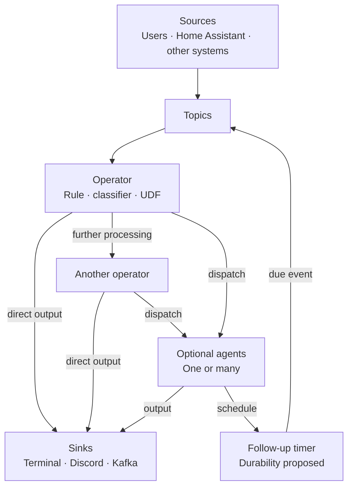
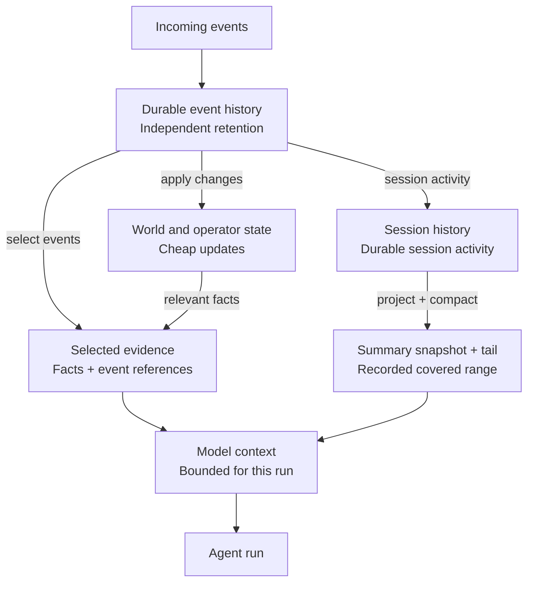
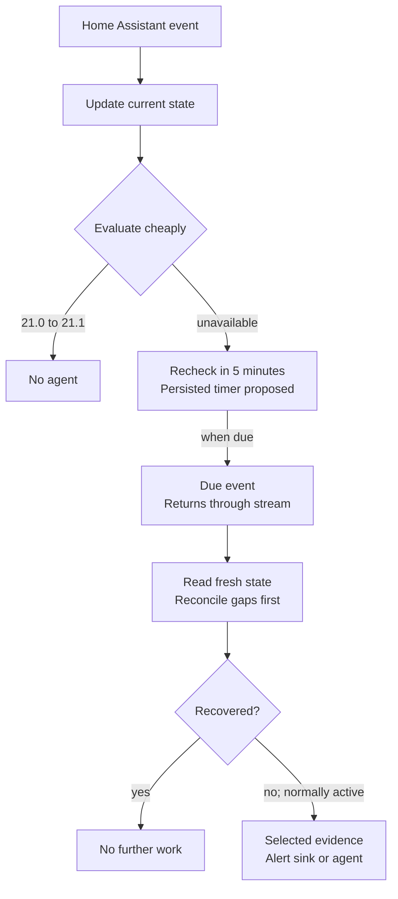
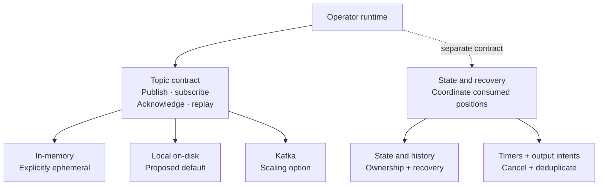

# Brook architecture draft

Brook is a Rust event-processing platform with optional agents. Its purpose is to keep routine work inexpensive: record what happened, update state, and use rules or small classifiers before starting a costly model-backed run. Extensibility, clean interfaces, easy use, and useful defaults guide the design.

This is a documentation-only proposal. **Agreed** describes foundations already accepted for the project. **Proposed** identifies a concrete starting point for review. **Open** marks decisions that still affect the contracts. None of these sections describes implemented behavior or a stable API.

## Agreed foundations

- Events can originate from users, Home Assistant, or other systems.
- Processing forms a general operator graph. Operators can route to other processors, one or many agents, or directly to sinks. Agents are optional, and graphs may contain feedback through events and timers.
- Inexpensive deterministic or model-backed processing should reduce unnecessary agent activations and token use.
- Kafka-like topics should support interchangeable in-memory, local on-disk, and Kafka backends.
- Wasm is the preferred direction for portable user-defined functions.
- Durable event and session history are distinct from the limited context presented to a model. The same event may update state and be evaluated at several stages.
- Context compaction produces a lossy summary snapshot plus a recent tail. The covered history range is recorded; original history follows a separate retention policy.
- Client conversation identifiers are resolved and validated into internal, namespaced session identifiers. Device and world state enter conversation context only when relevant.

## The operator graph

*Agreed shape; illustrative wiring. Every processing box may emit downstream work. Timer durability and the routing API remain proposals. [Editable Mermaid](diagrams/operator-graph.mmd) · [SVG view](diagrams/operator-graph.svg).*

A source adapter normalizes input and publishes an event. Operators consume events and may update state, classify, transform, suppress further work, or emit results. A direct user message can use a simple rule that wakes an agent. A sensor change may require only a state update. A known alert can go straight to a notification sink without an LLM.

Rules, JEV/CLEF, LightGBM, and custom UDFs are candidate processing options. Their contracts and suitability need evaluation. This draft does not assume an architecture or runtime for JEV/CLEF, or select a model library.

**Proposed:** operators expose named output ports that configuration connects to operators, topics, or sinks. One result may fan out to several destinations. Direct addressing is an alternative still to review. A compact decision vocabulary could include `Ignore`, `RecheckAt`, and `Dispatch` to one or more destinations, with a reason and references to relevant context. These are conceptual names, not Rust types. `Ignore` means no downstream activation for that decision; it does not undo the state update or delete the event.

Output adapters can target the CLI or terminal, Discord, Kafka, and other destinations. An agent result can be input to another processor. Follow-up requests return through the event stream rather than remaining inside an indefinitely running agent. Proposed limits on time, steps, tokens, retries, and follow-ups bound feedback loops; cancellation must invalidate outstanding work.

**Open:** routing failures, classifier uncertainty, and invalid results need explicit policies. Critical user input must not silently disappear because a cheap stage fails. Retry, quarantine, and a configured fallback route are candidates; a universal fallback has not been chosen.

## Events and topic semantics

**Proposed event envelope:** stable event identity, source, type, schema version, occurrence and receipt times, routing key, payload, and correlation or causation references. Session identity is optional because many events are unrelated to conversations. Trace metadata should make a decision explainable without copying a large payload through every stage.

[CloudEvents](https://github.com/cloudevents/spec/blob/main/cloudevents/spec.md) provides a useful reference for interoperable event metadata and source-scoped identity. Adopting its envelope, bindings, and extension conventions is an open choice.

The proposed topic contract is:

- Preserve order within a routing key, with no global-order promise. Define how concurrent producers and late source events are reconciled.
- Give independent subscriptions their own view and cursor. Workers sharing one subscription divide its work; separate subscriptions enable fan-out.
- Expect at-least-once delivery where durable delivery is supported. Preserve stable identities and make state updates and effects safe to repeat.
- Expose acknowledgements, replay positions, retention limits, and backend durability capabilities explicitly.
- Define bounded buffering and backpressure. A slow agent or sink should not turn into an unbounded queue in process memory.

These are proposed Brook semantics, informed by [Kafka's partition, consumer, and delivery model](https://kafka.apache.org/41/design/design/). The exact mapping to each backend still needs design and tests. Topic retention bounds replay; a promise of durable session history cannot depend on an input topic retaining every event forever.

## State history and model context

*Agreed separation; proposed logical views. Boxes do not require separate databases, and ownership and consistency are open. [Editable Mermaid](diagrams/state-and-context.mmd) · [SVG view](diagrams/state-and-context.svg).*

Three responsibilities need to remain distinguishable:

1. **Durable history** records events and the session activity needed for inspection, recovery, and later context selection, subject to retention.
2. **Current state** represents the latest useful world, device, or operator facts. Updating a temperature or device status can be cheap and does not require a prompt.
3. **Model context** is a bounded projection assembled for a particular run from relevant history, current facts, instructions, and available tools.

A session is therefore more than a context window. Compaction may replace older material in a prompt with a summary, but that summary is lossy. It needs the covered history range and a way to identify its source. Keeping a recent tail preserves detail near the current interaction. Retaining originals separately allows later retrieval or rebuilding while they remain within retention. This semantic context compaction is separate from Kafka's key-based log compaction.

For Home Assistant, a flood of raw device events should update the relevant state view without becoming a growing conversation transcript. If an agent is activated, its context might include the current device status, last healthy observation, outage duration, and selected related events.

**Open:** Brook could maintain a materialized world-state view, fetch state from connectors on demand, or combine both. An initial snapshot, change-stream continuity, freshness, and reconnect reconciliation need a defined contract. A missing or stale observation must be distinguishable from a confirmed state. No database, storage crate, or distributed consistency model is selected here.

## Agents sessions and runs

**Proposed:** distinguish an agent definition, a session, and a run. The definition describes behavior and capabilities; the session groups durable activity; the run is one bounded execution. A client-supplied conversation identifier must resolve within its authorized namespace rather than selecting an arbitrary internal session.

**Proposed starting policy:** one active run per session with a mailbox for arriving events. Batching or coalescing may reduce redundant work, but explicit user messages need preservation and ordering rules. Cancellation needs a generation or equivalent validity check so an old completion cannot overwrite newer state or revive a cancelled follow-up.

**Open:** multiple agents might share a session or use isolated sessions linked by events. That choice affects context, permissions, serialization, and who can update a shared summary. Session ownership, failover, and fencing also need definition before concurrent workers can safely operate across processes.

## Home Assistant example

*Illustrative behavior. Cheap state updates and selective context are agreed; durable recheck mechanics are proposed. [Editable Mermaid](diagrams/home-assistant-recheck.mmd) · [SVG view](diagrams/home-assistant-recheck.svg).*

A temperature changing from 21.0 to 21.1 updates current state. If no rule considers that change important, processing stops without waking an agent.

A normally active device becoming unavailable can instead schedule a recheck five minutes later. When the timer fires, the recheck returns through the stream and evaluates fresh state. If the device recovered, no agent is needed. If it is still unavailable, policy can route directly to an alert sink or start an agent with selected evidence. If source continuity is unknown, the evaluation should handle that uncertainty rather than treating stale data as proof of an ongoing outage.

The five-minute interval is an example, not a global default. The scheduler should retain the reason, relevant event references, due time, and cancellation identity. A later recovery may cancel the recheck or make it a harmless no-op. Duplicate timer delivery should not produce duplicate notifications.

An agent can request another follow-up event under the same bounded scheduling model. Proposed budgets, expiry, and cancellation prevent a self-rescheduling run from continuing without limits.

## Transport and recovery

*Agreed backend choices; proposed boundaries and default. State placement and crash-recovery coordination remain open. [Editable Mermaid](diagrams/transport-boundary.mmd) · [SVG view](diagrams/transport-boundary.svg).*

In-memory transport is useful for tests and explicitly ephemeral use. A local on-disk backend is the proposed starting default for durable single-process use. Kafka is the scaling option. Backend selection should preserve operator interfaces while exposing meaningful differences in durability and deployment.

Kafka moves and retains events; adopting it does not settle ownership of state, sessions, or timers. Distributed operation still needs recovery checkpoints, ownership transfer, and fencing against stale workers.

**Proposed reliability requirement:** processing must coordinate the consumed position, state updates, timer changes, and output intents so a crash cannot silently lose acknowledged work. A local transactional boundary may cover these together. Kafka plus a separate state store requires an explicit outbox, checkpoint, or recovery protocol. The mechanism is open.

External effects need special treatment. Replaying an event must not casually resend a Discord message or repeat an agent tool action. Persisted output intents, stable effect identities, sink-supported idempotency, and an explicit replay mode are candidates. An outbox alone cannot guarantee exactly-once effects at a destination that cannot deduplicate. Brook makes no end-to-end exactly-once promise; [Kafka's delivery documentation](https://kafka.apache.org/41/design/design/) likewise distinguishes Kafka transactions from cooperating external destinations.

## Extension boundaries

Wasm is the preferred direction for portable UDFs that perform classification or transformation. **Proposed:** expose versioned inputs and outputs plus narrowly granted host capabilities. A pure UDF should not need unrestricted network or filesystem access; side effects should pass through explicit runtime interfaces.

[WIT](https://component-model.bytecodealliance.org/design/wit.html) is a candidate for typed component contracts. Execution budgets, memory bounds, payload limits, and cancellation are required design concerns. Wasmtime documents [fuel and interruption](https://docs.wasmtime.dev/examples-interrupting-wasm.html) and [resource limits](https://docs.wasmtime.dev/api/wasmtime/trait.ResourceLimiter.html), which illustrate available mechanisms and their limits. Wasmtime itself has not been selected, and guest memory limits do not bound every host allocation.

**Proposed:** native libraries or service adapters may be a better fit for particular classifiers and models. They should meet the same conceptual operator contract without requiring every model to compile to Wasm. Automatic learning is later work; reliable event, state, and execution foundations come first.

## Prometheus integration

Prometheus integration is a candidate extension. Two proposed adapter roles are:

- **Input:** an Alertmanager webhook can turn existing alerts into Brook events. [Alertmanager](https://prometheus.io/docs/alerting/latest/alertmanager/) already groups, deduplicates, routes, silences, and inhibits alerts. Brook should respect that existing alert lifecycle.
- **Output:** Brook can expose metrics for Prometheus to scrape, including event counts, routing outcomes, lag, agent activations, token use, and errors. This is a metrics endpoint rather than a requirement to push arbitrary events into Prometheus.

**Proposed:** keep metric labels bounded and put individual session and event identifiers in structured diagnostic records instead. This follows [Prometheus instrumentation guidance](https://prometheus.io/docs/practices/instrumentation/) on avoiding excessive cardinality. Metric names, adapters, and recording rules are not specified yet.

## Questions for review

1. Should operators use named output ports or direct destination addressing? Is the proposed decision vocabulary sufficient for general processing and fan-out?
2. What state does Brook own, and what comes from connector reads? What freshness and reconciliation contract applies after a gap?
3. Can multiple agents share one session? What concurrency, batching, cancellation, and ownership rules follow?
4. What is the minimum backend contract, including local durability, replay, ordering, and atomic recovery of state, timers, and output intents?
5. What should happen when a router fails, confidence is low, or queues fill, particularly for explicit user input?
6. What is the smallest useful UDF capability surface, and which limits and versioning rules must every extension support?

The next architecture revision should resolve these boundaries before choosing crates or promising runtime behavior.
