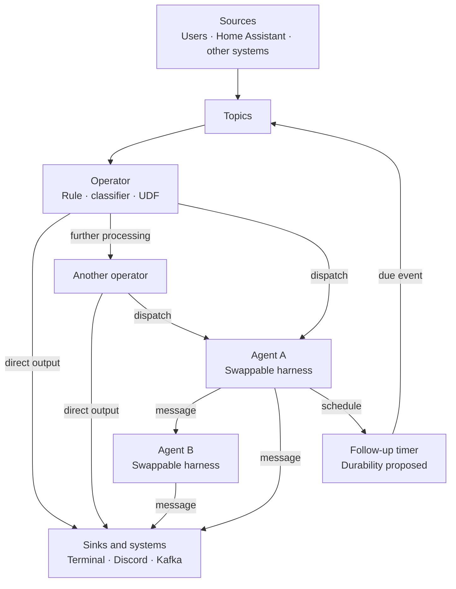
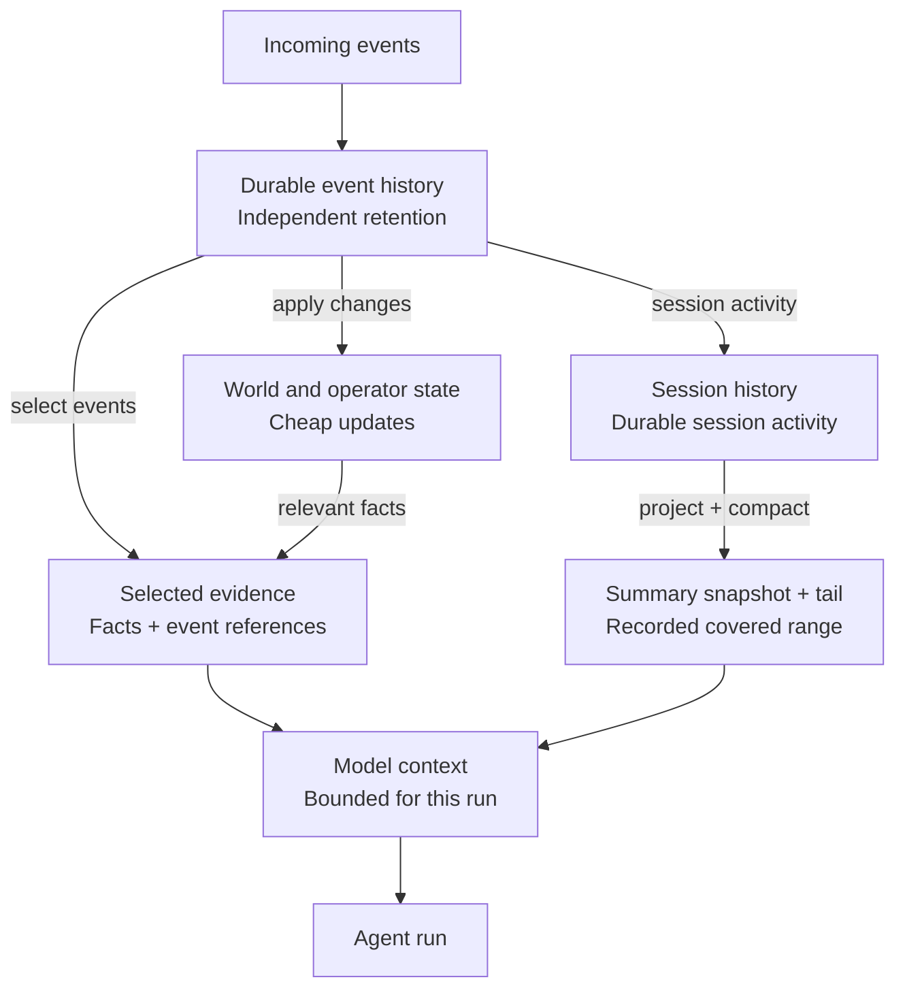
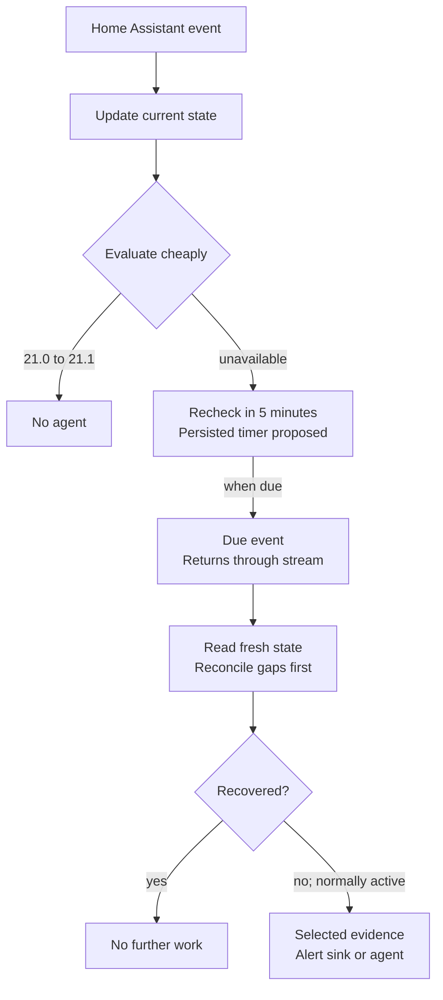
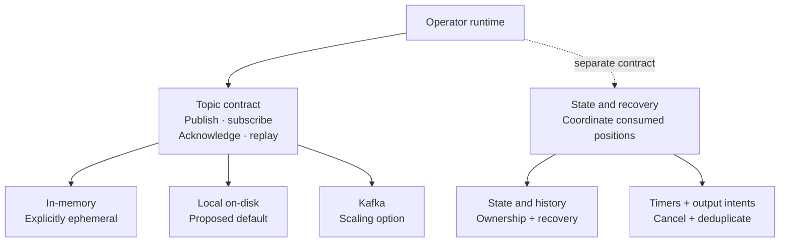

# Brook architecture draft

Brook is a Rust event-processing platform with optional agents and swappable agentic harnesses. Its purpose is to keep routine work inexpensive: record what happened, update state, and use rules or small classifiers before starting a costly model-backed run. Extensibility, clean interfaces, easy use, and useful defaults guide the design.

This is a documentation-only proposal. **Agreed** describes foundations already accepted for the project. **Proposed** identifies a concrete starting point for review. **Open** marks decisions that still affect the contracts. None of these sections describes implemented behavior or a stable API.

## Agreed foundations

- Events can originate from users, Home Assistant, or other systems.
- Processing forms a general operator graph. Operators can route to other processors, one or many agents, or directly to sinks. Agents are optional.
- Agents can use any agentic harness through a portable integration boundary. They can send messages themselves, including work for another agent or system. A more integrated native harness is an option to propose.
- Tools support synchronous execution and asynchronous messages. Async dispatch checkpoints the context that led to the message; the tool defines whether a return is expected. A return must recover that context or insert it when missing, correlate to its continuation, and preserve newer session activity.
- Dynamically evaluate circular dependencies and reject them, with retries the stated exception. The scope of a dependency is still to confirm.
- Inexpensive deterministic or model-backed processing should reduce unnecessary agent activations and token use.
- Kafka-like topics should support interchangeable in-memory, local on-disk, and Kafka backends.
- Wasm is the preferred direction for portable user-defined functions.
- Durable event and session history are distinct from the limited context presented to a model. The same event may update state and be evaluated at several stages.
- Context compaction produces a lossy summary snapshot plus a recent tail. The covered history range is recorded; original history follows a separate retention policy.
- Client conversation identifiers are resolved and validated into internal, namespaced session identifiers. Device and world state enter conversation context only when relevant.

## The operator graph



*General routing and agent messaging are agreed. The feedback path assumes the proposed dependency scope below. Wiring, timer durability, and routing APIs remain proposals. [Editable Mermaid](diagrams/operator-graph.mmd) · [SVG view](diagrams/operator-graph.svg).*

A source adapter normalizes input and publishes an event. Operators consume events and may update state, classify, transform, suppress further work, or emit results. A direct user message can use a simple rule that wakes an agent. A sensor change may require only a state update. A known alert can go straight to a notification sink without an LLM.

Rules, JEV/CLEF, LightGBM, and custom UDFs are candidate processing options. Their contracts and suitability need evaluation. This draft does not assume an architecture or runtime for JEV/CLEF, or select a model library.

**Proposed:** operators expose named output ports that configuration connects to operators, topics, or sinks. One result may fan out to several destinations. Direct addressing is an alternative still to review. A compact decision vocabulary could include `Ignore`, `RecheckAt`, and `Dispatch` to one or more destinations, with a reason and references to relevant context. These are conceptual names, not Rust types. `Ignore` means no downstream activation for that decision; it does not undo the state update or delete the event.

Agents send messages through the graph, including agent-to-agent requests and output to other systems. Replies and timed follow-ups return through the stream. **Proposed:** time, step, token, retry, and follow-up budgets bound feedback; cancellation invalidates outstanding continuations.

**Open:** routing failures, classifier uncertainty, and invalid results need explicit policies. Critical user input must not silently disappear because a cheap stage fails. Retry, quarantine, and a configured fallback route are candidates; a universal fallback has not been chosen.

## Events and topic semantics

**Proposed event envelope:** stable event identity, source, type, schema version, occurrence and receipt times, routing key, payload, and correlation or causation references. Session identity is optional because many events are unrelated to conversations. Trace metadata should make a decision explainable without copying a large payload through every stage.

[CloudEvents](https://github.com/cloudevents/spec/blob/main/cloudevents/spec.md) provides a useful reference for interoperable event metadata and source-scoped identity. Adopting its envelope, bindings, and extension conventions is an open choice.

The proposed topic contract is:

- Preserve order within a routing key, with no global-order promise. Define how concurrent producers and late source events are reconciled.
- Give independent subscriptions their own view and cursor. Workers sharing one subscription divide its work; separate subscriptions enable fan-out.
- Expect at-least-once delivery where durable delivery is supported. Preserve stable identities and make state updates and effects safe to repeat.
- Expose acknowledgements, replay positions, retention limits, and backend durability capabilities explicitly.
- Define bounded buffering and backpressure. A slow agent or sink should not turn into an unbounded queue in process memory.

These are proposed Brook semantics, informed by [Kafka's partition, consumer, and delivery model](https://kafka.apache.org/41/design/design/). The exact mapping to each backend still needs design and tests. Topic retention bounds replay; a promise of durable session history cannot depend on an input topic retaining every event forever.

## State history and model context



*Agreed separation; proposed logical views. Boxes do not require separate databases, and ownership and consistency are open. [Editable Mermaid](diagrams/state-and-context.mmd) · [SVG view](diagrams/state-and-context.svg).*

Three responsibilities need to remain distinguishable:

1. **Durable history** records events and the session activity needed for inspection, recovery, and later context selection, subject to retention.
2. **Current state** represents the latest useful world, device, or operator facts. Updating a temperature or device status can be cheap and does not require a prompt.
3. **Model context** is a bounded projection assembled for a particular run from relevant history, current facts, instructions, and available tools.

Context summaries are lossy and record their covered range and sources. A recent tail preserves nearby detail; originals remain available for retrieval or rebuilding within their separate retention policy. This semantic compaction is separate from Kafka's key-based log compaction.

For Home Assistant, a flood of raw device events should update the relevant state view without becoming a growing conversation transcript. If an agent is activated, its context might include the current device status, last healthy observation, outage duration, and selected related events.

**Open:** Brook could maintain a materialized world-state view, fetch state from connectors on demand, or combine both. An initial snapshot, change-stream continuity, freshness, and reconnect reconciliation need a defined contract. A missing or stale observation must be distinguishable from a confirmed state. Storage and distributed consistency choices remain open.

## Harnesses sessions and continuations

**Agreed:** agentic harnesses are swappable. Brook supplies integration tools for graph messaging and synchronous or asynchronous work. An agent can queue work for another agent or system and continue when the expected data returns. **Proposed:** a native Brook harness offers tighter integration alongside adapters for other harnesses; it is not required for graph participation.

**Proposed identities:** an agent definition describes behavior and capabilities, a session groups durable activity, and a run is a bounded execution. Client conversation identifiers resolve within an authorized namespace. One active run per session with a mailbox is a proposed starting policy. An awaited continuation need not occupy an active run slot; newer events may advance the session meanwhile. Shared versus isolated multi-agent sessions, ownership, and batching remain open.

### Tool execution

Synchronous tools return through the harness's ordinary tool-call flow. Async tools declare whether they are **fire-and-forget** or **await-result**. Fire-and-forget records the outgoing work without creating a result continuation. Await-result captures what the agent will need when a correlated reply arrives. Transport acknowledgement is not the tool's result.

```mermaid
flowchart TB
    accTitle: Brook asynchronous continuation
    accDescr: An async tool declares whether a return is expected. Before dispatch, persist its context checkpoint, request, and output intent. A valid correlated return recovers or inserts context while preserving the tool call and result. Stale or duplicate replies do not resume the continuation.
    call["Async tool call<br/>Declares reply mode"]
    checkpoint["Persist before dispatch<br/>Checkpoint + request + output intent"]
    send["Dispatch message<br/>Agent or external system"]
    oneway["Fire-and-forget<br/>No result continuation"]
    reply["Await-result<br/>Correlated return event"]
    valid{"Valid continuation?<br/>ID · cancellation · status"}
    ignore["Do not resume<br/>Duplicate · cancelled · expired"]
    context["Recover or insert context<br/>Preserve tool call/result pair"]
    run["Continue through harness<br/>Keep newer session activity"]
    call --> checkpoint
    checkpoint --> send
    send -->|no return expected| oneway
    send -->|return expected| reply
    reply --> valid
    valid -->|invalid or already handled| ignore
    valid -->|valid| context
    context --> run
```

*Checkpointed async context and tool-defined replies are agreed requirements. The persistence sequence, correlation fields, and resume policy below are proposed. [Editable Mermaid](diagrams/async-continuation.mmd) · [SVG view](diagrams/async-continuation.svg).*

**Proposed continuation contract:**

1. Before accepting awaited work, perform the dependency admission described below. Before dispatch, durably coordinate a context checkpoint, request record, and output intent. Capture the originating tool call and causal context, directly or by durable references. Record request/continuation correlation, tool-call identity, expected reply shape, harness/configuration version, cancellation generation, and context revision. The storage protocol is open; a crash must not leave delivered work without its recovery record.
2. Dispatch through the graph. Validate returning correlation, reply shape, cancellation generation, and pending status. A newer context revision alone does not invalidate a reply. Atomically claim the pending continuation, record the reply, and enqueue its resume, or use an equivalent crash-safe protocol. Duplicate replies cannot claim it twice; cancellation or timeout closes it. Late results cannot revive it. Retry and failure policies preserve request and effect identities.
3. Recover the captured context or insert the missing originating material with its result. Preserve valid tool-call/result pairing and any newer session activity. Use version checks and a deliberate append, merge, or branch policy; never replace newer context with an old snapshot. The exact conflict policy remains open.

A checkpoint is a portable context/reconstruction record, optionally supplemented by a harness-specific resume handle. It does not promise serialization of arbitrary third-party runtime internals. **Open:** adapters need capability negotiation for context export/import, result insertion, resumable execution, and cancellation. Rebuilding a transcript and starting a new run is a possible degraded mode, not guaranteed same-execution recovery. Unsupported modes must be explicit; fallback policy is still to decide.

### Dynamic dependency evaluation

**Agreed requirement:** dynamically reject circular dependencies, with retries the exception. **Proposed scope, still to confirm:** track outstanding logical work and waits separately from routing topology. Synchronous calls and async await-result work both participate. Reject a new wait when it creates a direct or indirect cycle, such as A waiting for B while B waits for A. Returning messages or later follow-ups may revisit an agent without adding a wait cycle under this interpretation.

**Proposed:** checking for a cycle and accepting its dependency must be one race-safe operation across concurrent or distributed additions. Remove active wait edges on terminal completion, cancellation, or timeout. Retries retain logical work identity with bounded attempt identities; renaming a retry cannot bypass cycle detection. Storage and coordination mechanisms remain open.

Fire-and-forget messages can circulate without wait edges. They need separate causation tracking and hop, time, or work budgets. Those limits bound routing loops; they do not prove dependency acyclicity. Whether this requirement also rejects message-only loops remains an explicit review question.

## Home Assistant example



*Illustrative behavior. Cheap state updates and selective context are agreed; durable recheck mechanics are proposed. [Editable Mermaid](diagrams/home-assistant-recheck.mmd) · [SVG view](diagrams/home-assistant-recheck.svg).*

A temperature changing from 21.0 to 21.1 updates current state. If no rule considers that change important, processing stops without waking an agent.

A normally active device becoming unavailable can instead schedule a recheck five minutes later. When the timer fires, the recheck returns through the stream and evaluates fresh state. If the device recovered, no agent is needed. If it is still unavailable, policy can route directly to an alert sink or start an agent with selected evidence. If source continuity is unknown, the evaluation should handle that uncertainty rather than treating stale data as proof of an ongoing outage.

Five minutes is illustrative. **Proposed:** persist the reason, event references, due time, and cancellation identity. Recovery can cancel the recheck or make it a no-op; duplicate delivery must not duplicate notifications. Agent follow-ups use the same bounded scheduling model.

## Transport and recovery



*Agreed backend choices; proposed boundaries and default. State placement and crash-recovery coordination, including continuation checkpoints, remain open. [Editable Mermaid](diagrams/transport-boundary.mmd) · [SVG view](diagrams/transport-boundary.svg).*

In-memory transport is useful for tests and explicitly ephemeral use. A local on-disk backend is the proposed starting default for durable single-process use. Kafka is the scaling option. Backend selection should preserve operator interfaces while exposing meaningful differences in durability and deployment.

Kafka moves and retains events; adopting it does not settle ownership of state, sessions, or timers. Distributed operation still needs recovery checkpoints, ownership transfer, and fencing against stale workers.

**Proposed reliability requirement:** processing must coordinate the consumed position, state updates, timer changes, continuation checkpoints, and output intents so a crash cannot silently lose acknowledged work. A local transactional boundary may cover these together. Kafka plus a separate state store requires an explicit outbox, checkpoint, or recovery protocol. The mechanism is open.

External effects need special treatment. Replaying an event must not casually resend a Discord message or repeat an agent tool action. Persisted output intents, stable effect identities, sink-supported idempotency, and an explicit replay mode are candidates. An outbox alone cannot guarantee exactly-once effects at a destination that cannot deduplicate. Brook makes no end-to-end exactly-once promise; [Kafka's delivery documentation](https://kafka.apache.org/41/design/design/) likewise distinguishes Kafka transactions from cooperating external destinations.

## Extension boundaries

Wasm is the preferred direction for portable UDFs that perform classification or transformation. **Proposed:** expose versioned inputs and outputs plus narrowly granted host capabilities. A pure UDF should not need unrestricted network or filesystem access; side effects should pass through explicit runtime interfaces.

[WIT](https://component-model.bytecodealliance.org/design/wit.html) is a candidate for typed component contracts. Execution budgets, memory bounds, payload limits, and cancellation are required design concerns. Wasmtime documents [fuel and interruption](https://docs.wasmtime.dev/examples-interrupting-wasm.html) and [resource limits](https://docs.wasmtime.dev/api/wasmtime/trait.ResourceLimiter.html), which illustrate available mechanisms and their limits. Wasmtime itself has not been selected, and guest memory limits do not bound every host allocation.

**Proposed:** native libraries or service adapters may be a better fit for particular classifiers and models. They should meet the same conceptual operator contract without requiring every model to compile to Wasm. Automatic learning is later work; reliable event, state, and execution foundations come first.

## Prometheus integration

Prometheus integration is a candidate extension. Two proposed adapter roles are:

- **Input:** an Alertmanager webhook can turn existing alerts into Brook events. [Alertmanager](https://prometheus.io/docs/alerting/latest/alertmanager/) already groups, deduplicates, routes, silences, and inhibits alerts. Brook should respect that existing alert lifecycle.
- **Output:** Brook can expose metrics for Prometheus to scrape, including event counts, routing outcomes, lag, agent activations, token use, and errors. This is a metrics endpoint rather than a requirement to push arbitrary events into Prometheus.

**Proposed:** keep metric labels bounded and put individual session and event identifiers in structured diagnostic records instead. This follows [Prometheus instrumentation guidance](https://prometheus.io/docs/practices/instrumentation/) on avoiding excessive cardinality. Metric names, adapters, and recording rules are not specified yet.

## Bounded formal checks

The [TLA+ models](../spec/README.md) explore proposed wait admission and continuation safety contracts, with reproducible bounded TLC runs and counterexamples for unsafe alternatives. They assume the outstanding-logical-waits interpretation of dependency cycles, which remains open for confirmation. Atomic storage transitions are requirements of the models, not verified implementation mechanisms. These checks do not prove the whole architecture or establish liveness.

## Questions for review

1. What portable harness capabilities are required? When may an adapter reconstruct context and start a new run instead of resuming the original execution?
2. Should messaging use named output ports or direct destinations? What happens on routing failure, low confidence, or queue saturation?
3. Can agents share a session? How should replies merge or branch when its context has advanced, and who owns concurrent updates?
4. What state does Brook own versus fetch from connectors, and how are gaps and stale observations reconciled?
5. What is the minimum recovery contract across backends for state, timers, continuation checkpoints, output intents, and consumed positions?
6. Does circular-dependency rejection cover outstanding waits only, or message-only cycles too? How are concurrent admission, terminal cleanup, and retry identity coordinated?

Resolve these boundaries before choosing crates or promising runtime behavior.
