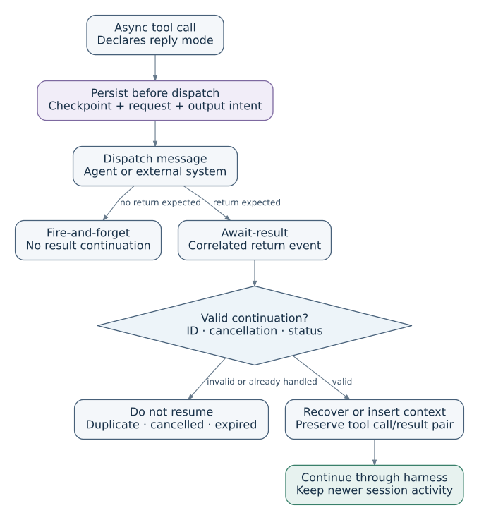

# Sessions, context and authorized delivery

These contracts refine the [architecture](architecture.md). An agent is a graph
node; awaited work and its origin-result delivery use the same durable execution
model as other graph work. See [status and limits](architecture.md#status-and-limits)
for implementation coverage and [local reliability](local-reliability.md) for
admission, ownership, recovery and retention.

## Resolve sessions from trusted ingress

```text
(authenticated namespace, trusted client, external conversation ID)
    → stable internal session ID
```

The namespace is an authenticated account/workspace boundary. The client is a
configured producer/sink adapter, not an arbitrary payload field or an agent
configuration. Identical external conversation IDs in different clients or
namespaces identify different sessions.

The trusted adapter validates the external ID against its connection's authority.
Claimed namespace, session or route fields in event data cannot override that
resolution. Unknown, ambiguous or unauthorized mappings fail explicitly.
Automatic creation uses a scoped uniqueness constraint; reconnects reuse the
existing mapping. Do not reuse an internal session ID for another conversation.
Aliases, merges and cross-namespace access require separate authorization.

`AgentConfig` describes an agent's behavior and capabilities; the harness executes
it, and the session owns durable conversational activity. A session does not grant
access to every sink or recipient associated with its principal.

## Bind work and returns before dispatch

An agent-to-agent request has three independent references:

| Reference | Responsibility |
| --- | --- |
| Source session | Owns the request, causal evidence and eventual continuation |
| Destination | Authorized agent/service and destination session or isolated work scope |
| Return binding | Request correlation and expected responder; resolves to the origin |

A receiving agent's session cannot replace the source conversation. A request ID
is a correlation reference, not bearer authority.

Admission atomically persists immutable arguments, logical request/effect IDs,
source and destination bindings, expected responder/reply schema, expiry,
cancellation generation, context revision, causal pins and outgoing intent.
Capture code/config/schema versions and bounded attempt metadata. Retries retain
logical identity and immutable bindings; different arguments under the same
operation key conflict.

Logical branch selection chooses a configured path, not a recipient grant. A
transform can be inserted on that path without changing the router. Versioned
configuration pins in-flight work so an edit cannot silently redirect it.

## Portable asynchronous execution



[Editable continuation flow](diagrams/async-continuation.mmd).

1. An async tool declares fire-and-forget or await-result. Brook commits the work
   and authorized outbox intent before returning a pending receipt. Await-result
   also records origin correlation and required causal evidence. This receipt
   completes the immediate provider tool invocation; it is not the work's outcome.
2. The current run can continue or end. Waiting work releases the active-run slot;
   ordinary messages and other requests can advance the session. One active
   agent invocation per session is the proposed initial scheduling policy;
   pending work remains bounded.
3. A later reply is authenticated against the stored expected responder. Check
   correlation, schema, expiry, pending status and cancellation. Atomically record
   the accepted outcome and origin delivery. Duplicate replies cannot create a
   second logical continuation; late replies cannot reopen closed work.
4. The scheduler assembles fresh bounded context and admits the origin invocation
   with revision/cancellation checks. The original logical call, pending receipt
   and eventual outcome remain associated without inserting a stale provider
   result into an advanced transcript.

Replies may arrive out of order. A newer revision alone does not invalidate a
reply; it requires the resumed invocation to use current context. An awaited
return is a separate invocation through its durable binding, not an arbitrary
DAG back-edge. Dynamic agent wait chains need the additional admission rules
identified in the architecture.

Any harness supporting this portable contract can start the fresh run. Exact
suspended-execution resume is an optional advertised capability with separate
transcript/version/concurrency requirements. Brook does not require serialized
provider internals or select a production agent loop.

Request cancellation/expiry closes only that request. A session reset increments
that session's cancellation generation, invalidating its older continuations.
Ordinary messages and compaction do not increment it. Check cancellation at reply
acceptance and invocation admission; invocation cancellation also fences its later
commits. Pipeline drain stops new ingress while admitted work settles. Neither
operation retracts admitted external effects.

## Assemble bounded context from protected evidence

| Record | Role |
| --- | --- |
| Session history | Ordered, session-owned events with stable identities; immutable while retained |
| Historical representation | Replaceable text or structured projection with format, source coverage and provenance |
| Request checkpoint | Portable references to required instruction, logical call/receipt and causal material |

Context is a selection, not the entire historical transcript. At request creation,
pin exact evidence required to interpret its return. Protection continues through
accepted outcomes, pending execution and unresolved recovery, not just while a
reply is pending. Storage tier changes must preserve recoverability. Release pins
only when all dependent obligations settle.

At resume, load the accepted outcome and immutable request, then verify protected
source identities and versions. Read the current session revision and construct a
causal block containing instruction, call, receipt and outcome. Combine it with a
bounded recent tail, relevant current facts and optional historical representations
or retrieved evidence. Record the manifest's included/covered references,
provenance and revision before admission.

Compactors may emit prose or structured data; their output is historical evidence,
not instructions or authorization. Retrievers select references within authorized
scopes. Session-history references must belong to the same session; external-corpus
RAG requires separate access and source-provenance checks. The host verifies raw
references and enforces budgets regardless of extension output.

Lossy summaries cannot replace protected exact evidence. If required evidence is
missing, corrupt, unsupported or too large, fail explicitly or use an explicitly
authorized alternative with its own contract. Never silently truncate it or invent
it from model memory. Optional context can be compacted or omitted within policy.
If history advances during assembly, rebuild before admission; do not overwrite
newer history with an old snapshot.

Compaction changes representation, not history identity or cancellation. Collection
is separate: a seven-day unused-record default cannot delete a live reference.
Rebuilding a projection can use retained available history; it never assumes that
all old history still exists. Missing required sources produce recovery failure,
not a successful resume.

## Authorize each outgoing intent

The origin has a default reply route, but each message has its own permission.
A user can authorize an email from a chat session while a separate acknowledgement
goes back to chat. Resolve the intended account, recipient, action and data scope
from authenticated instructions and policy; ask when that authority is ambiguous.
A model suggestion, display name or raw address is not a grant.

Persist the intent's logical effect identity, source principal/session, grant
reference, resolved sink/provider, sending account, recipient/thread, data scope,
binding version and expiry. Routers, transforms, replies and retries cannot
silently substitute another recipient, account or scope. A changed destination
requires a new authorized intent; a retry preserves the original effect key.

At effect admission, atomically validate the current grant and pinned binding.
Missing, revoked, expired, mismatched or recycled bindings fail closed, with no
fallback to another channel. Prevent identity/version reuse that could make a
stale binding appear valid again. An earlier preflight is insufficient.

The safety boundary is authority valid at admission for that exact intent. A
provider operation already admitted may finish after revocation or lease expiry;
stronger revocation requires provider cooperation. Database admission and remote
I/O are not globally atomic. Correct destination routing does not establish
provider exactly-once delivery or content confidentiality. Preserve unknown
outcomes for [evidence-based recovery](local-reliability.md#recover-uncertain-effects).
